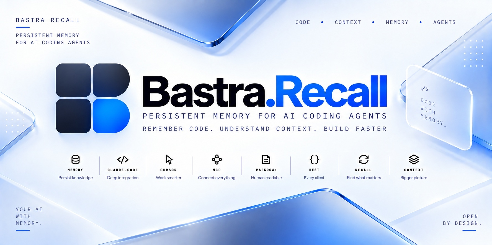
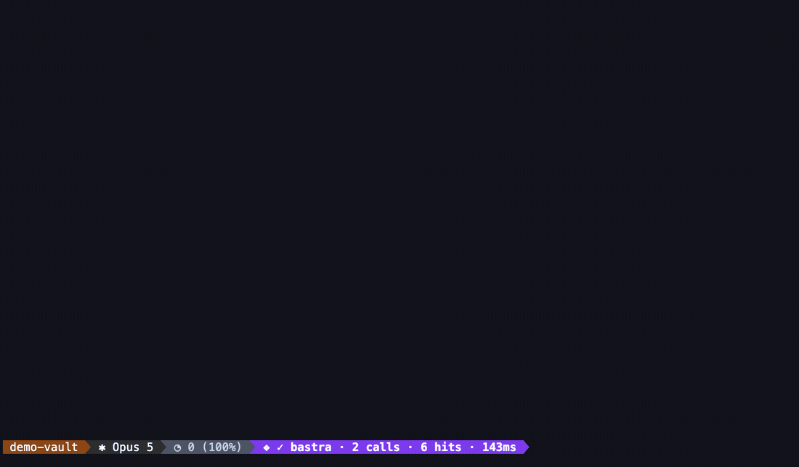

<p align="center">
  
</p>

# Bastra Recall

[English](#english) · [Deutsch](#deutsch)

[](https://bastra.io)
[](https://discord.gg/5yNaXsRhWB)
[](./LICENSE)
[](https://modelcontextprotocol.io/)

<a id="english"></a>

## 🇬🇧 English

**Less repeating yourself. One shared memory for your AI tools.**

We’re building with the ambition to create the best personal memory for everyday work with AI—open, transparent, and under your control.

Keep your preferences, decisions and hard-won fixes available beyond a single chat. Bastra Recall stores them as readable Markdown files on your computer and makes them available to your connected AI assistants.

Supported integrations help assistants save useful lessons and retrieve relevant memories before starting work. You can inspect and edit the files yourself, with Obsidian or any text editor. Automatic recall depends on the client integration and the assistant; it does not guarantee that every instruction will be followed.

### Why not just CLAUDE.md?

A CLAUDE.md or AGENTS.md works well while it is small. Every month of project work makes it longer, and the assistant gets all of it in every session, needed or not. Eventually nobody maintains it, and conventions start drifting again.

Bastra Recall picks up there:

- **Targeted, not everything:** Each decision and lesson is stored as its own file. Supported integrations surface the relevant entries before work instead of sending everything every time.
- **Grows as you work:** The assistant can record new decisions and solved problems while it works. You review and correct them as needed instead of adding everything by hand.
- **One memory for several tools:** Claude Code, Codex and other MCP-capable tools share the same vault, so you don't have to keep separate rule files in sync.

Keep your CLAUDE.md. Recall adds the knowledge that doesn't belong in every session.

**Version 1.0 is available.** Find published downloads in the [latest release](https://github.com/n0mad-ai/bastra-recall/releases/latest), changes in the [changelog](./CHANGELOG.md), and tested integrations in the [support matrix](#supported-surfaces).

<p align="center">
  
</p>

<p align="center"><sub>Two questions, answered from a vault the assistant was never told to search. The bar at the bottom is Claude Code's status line.</sub></p>

### Install

**macOS — guided setup:**

```bash
curl -fsSL https://bastra.io/install | bash
```

The script installs Homebrew if needed, installs Bastra Recall and starts setup. Choose a folder for your memories and the AI clients you want to connect. [Read the installer](./distribution/install.sh) before running it if you prefer.

**macOS or Linux — with Node 22+:**

```bash
npx bastra-recall install
```

No prior global npm installation is needed. Alternatively: `npm install -g bastra-recall`, then `bastra install`.

Restart your AI client after setup. Claude Desktop needs its [one-time memory setup](https://github.com/n0mad-ai/bastra-recall/wiki/Claude-Desktop); Codex users should review and trust the installed hooks as described in the [Codex guide](./docs/CODEX.md).

Run `bastra doctor` to check the setup; `bastra doctor --fix` repairs registrations. [Other installation methods](./docs/INSTALL.md) cover the macOS download, source builds and manual configuration.

### Try your first memory

1. Tell your assistant: “Remember: for this project, explain your changes briefly and include how you checked them.”
2. Ask it to show the saved memory so you can check the wording.
3. Start a new session and ask: “What are my preferences for explaining changes in this project?”

You can repeat the lookup in another connected client using the same vault. This is a simple way to check that your tools share the memory; supported hooks also help surface relevant context during normal work.

### Supported surfaces

| AI client | Status | Setup and behavior |
|---|---|---|
| **Claude Code** | Tested — in daily use | MCP, Skill, seven quiet hooks and statusline |
| **Claude Desktop** | Tested | MCP and memory guidance; session context on the first tool call. [Setup](https://github.com/n0mad-ai/bastra-recall/wiki/Claude-Desktop), including the macOS `.mcpb` extension |
| **Codex CLI** | Verified for the v1.0 integration | MCP, Skill and native hooks. [Setup](./docs/CODEX.md) |
| **Codex IDE + ChatGPT Desktop** | Implemented; not yet field-tested | Share the local Codex configuration. [Setup and limitations](./docs/CODEX.md) |
| **Cursor** | Implemented; not yet field-tested | MCP registration; add project rules with `bastra rules cursor` |
| **ChatGPT Custom GPT Actions** | Planned | REST API and starter schema exist; the packaged integration is not yet ready. [Track progress](https://github.com/n0mad-ai/bastra-recall/issues/13) |

Other MCP clients can connect through the forwarder, but are untested. Scripts and other integrations can use the [REST API](./docs/USAGE.md#rest-api-for-non-mcp-clients). MCP is the protocol that lets an AI assistant use external tools such as this memory service.

### Supported platforms

| Platform | Status | Availability |
|---|---|---|
| **macOS** (Apple Silicon and Intel) | Supported | Homebrew and npm installation, `bastra autostart`, Claude Desktop `.mcpb` extension, `open_document` and compiled hook client |
| **Linux** (x86_64 and arm64) | Daemon, CLI, MCP and hooks | Install with npm; compiled hook client available. No Homebrew install path, macOS LaunchAgent (`bastra autostart`), `.mcpb` extension installation or `open_document`. The forwarder starts the daemon on demand. |
| **Windows** | not covered | No compiled hook client; not tested |

### Why

A project decision made on Monday should still be available on Thursday, even if you switch AI tools. Bastra Recall gives those tools a shared place to look:

- **Keep useful context:** preferences, decisions, project facts and lessons from solved problems.
- **Recall before work:** supported hooks surface context at session start and before actions; the shared Skill guides the assistant's own searches and saves.
- **Own the files:** memories are plain Markdown with structured metadata, readable and editable outside Bastra.
- **See what is remembered:** `bastra map` opens the local vault map for browsing, search and memory care.

[Examples from a working week](./docs/USAGE.md#cookbook) show how these fit together.

### Code awareness

Optional, off until you switch it on per repository with `bastra code enable`. Recall then tells your assistant, before it edits a file, which other files import or call into it — and adds a `find_code` lookup so a symbol can be found by name instead of grepped for. The code map is built locally by [Graphify](https://github.com/Graphify-Labs/graphify), reads only code, is never committed, and no language model ever sees your source. [How to use it](./docs/USAGE.md#code-awareness--what-depends-on-the-file-you-are-editing). macOS and Linux for now.

### Privacy and control

Storage and keyword search are local. When your assistant retrieves a memory, it receives that content as context; a cloud-based assistant may process it with its provider. Local storage does not make the whole AI session offline.

Semantic search is optional. `bastra embeddings on` sets up local Ollama embeddings; `bastra embeddings off` returns to keyword search. Choosing OpenAI embeddings explicitly sends queries and indexed memory text to OpenAI. [Privacy and network use](./docs/PRIVACY.md) explains these paths, file sync and optional network features.

A vault in iCloud, Google Drive or Dropbox uses that service's synchronization. Concurrent edits on multiple computers can conflict, including with Bastra's automatic metadata updates. Bastra does not provide managed multi-device synchronization. Keep backups and check conflicting copies before replacing a file.

### Guides

- [Import existing memories](https://github.com/n0mad-ai/bastra-recall/wiki/Importing-Memories) — lists, chat exports, rules and memory folders. Folder imports go directly into a separate intake area; the other paths stage candidates for review.
- [Vault map](https://github.com/n0mad-ai/bastra-recall/wiki/Vault-Map) — explore, search and flag memories for care.
- [Updates](https://github.com/n0mad-ai/bastra-recall/wiki/Updating) — update with `bastra update`, or opt into automatic updates.
- [Product docs](https://github.com/n0mad-ai/bastra-recall/wiki/Product-Docs) — let the assistant maintain user guides for your projects.
- [Bastra Commons](https://github.com/n0mad-ai/bastra-recall/wiki/Bastra-Commons) — optional community recipes with verification records.
- [Usage and troubleshooting](./docs/USAGE.md) · [Memory format](./docs/memory-schema.md) · [Architecture](./docs/architecture.md) · [Hooks](./docs/hooks.md) · [Save and recall triggers](./docs/triggers.md) · [Taxonomy](./docs/taxonomy.md) · [Valence and reflex](https://github.com/n0mad-ai/bastra-recall/wiki/Valence-and-Reflex)

### Roadmap

Version 1.0 focuses on measured recall quality, relevant session context and clearer control over memory use. The cumulative session context budget is being measured in shadow mode; it does not yet enforce a live session-wide limit. [Roadmap and release boundaries](./PLAN.md).

A native Bastra Mac app is in development. The open-source package already includes the local browser-based vault map and works independently of that app.

### License and contact

MIT — see [LICENSE](./LICENSE). The statusline includes [owloops/claude-powerline](https://github.com/owloops/claude-powerline) under its retained [MIT license](./packages/statusline/LICENSE).

[Ask a question](https://github.com/n0mad-ai/bastra-recall/discussions) · [Report a bug](https://github.com/n0mad-ai/bastra-recall/issues/new?template=bug_report.yml) · [Contribute](./CONTRIBUTING.md) · [Support the project](./SUPPORTERS.md). Report vulnerabilities privately via [SECURITY.md](./SECURITY.md).

Built by [Daniel / @n0mad-ai](https://github.com/n0mad-ai).

---

<a id="deutsch"></a>

## 🇩🇪 Deutsch

**Weniger wiederholen. Ein gemeinsames Gedächtnis für deine KI-Tools.**

Wir bauen mit dem Anspruch, das beste persönliche Gedächtnis für die tägliche Arbeit mit KI zu schaffen – offen, nachvollziehbar und unter deiner Kontrolle.

Bewahre deine Vorlieben, Entscheidungen und erarbeiteten Lösungen über einzelne Chats hinweg. Bastra Recall speichert sie als lesbare Markdown-Dateien auf deinem Rechner und macht sie deinen verbundenen KI-Assistenten zugänglich.

Unterstützte Integrationen helfen Assistenten, wichtige Erkenntnisse zu speichern und relevante Erinnerungen vor neuen Aufgaben abzurufen. Du kannst die Dateien selbst prüfen und bearbeiten – mit Obsidian oder jedem Texteditor. Automatischer Abruf hängt von der Integration und dem Assistenten ab; er garantiert nicht, dass jede Anweisung befolgt wird.

### Warum nicht einfach CLAUDE.md?

Eine CLAUDE.md oder AGENTS.md funktioniert gut, solange sie klein ist. Mit jedem Monat Projektarbeit wird sie länger, und der Assistent bekommt in jeder Sitzung alles vorgelegt, ob er es braucht oder nicht. Irgendwann pflegt sie niemand mehr, und die Konventionen driften wieder auseinander.

Bastra Recall setzt dort an:

- **Gezielt statt alles:** Jede Entscheidung und jede Lektion liegt als eigene Datei. Unterstützte Integrationen blenden vor der Arbeit die passenden Einträge ein, statt jedes Mal alles mitzuschicken.
- **Wächst mit:** Der Assistent kann neue Entscheidungen und gelöste Probleme während der Arbeit selbst festhalten. Du prüfst und korrigierst sie bei Bedarf, statt alles von Hand nachzutragen.
- **Ein Gedächtnis für mehrere Tools:** Claude Code, Codex und andere MCP-fähige Tools greifen auf denselben Vault zu, ohne dass du getrennte Regeldateien abgleichen musst.

Deine CLAUDE.md kann bleiben. Recall ergänzt sie um das Wissen, das nicht in jede Sitzung gehört.

**Version 1.0 ist verfügbar.** Veröffentlichte Downloads findest du im [aktuellen Release](https://github.com/n0mad-ai/bastra-recall/releases/latest), Änderungen im [Changelog](./CHANGELOG.md) und getestete Integrationen in der [Support-Matrix](#unterstützte-oberflächen).

<p align="center">
  
</p>

<p align="center"><sub>Zwei Fragen, beantwortet aus einem Vault, das der Assistent nicht durchsuchen sollte. Die Leiste unten ist die Statusleiste von Claude Code.</sub></p>

### Installation

**macOS – geführtes Setup:**

```bash
curl -fsSL https://bastra.io/install | bash
```

Das Skript installiert bei Bedarf Homebrew, installiert Bastra Recall und startet die Einrichtung. Wähle einen Ordner für deine Erinnerungen und die KI-Clients, die du verbinden möchtest. Du kannst das [Installationsskript vorher lesen](./distribution/install.sh).

**macOS oder Linux – mit Node 22+:**

```bash
npx bastra-recall install
```

Eine vorherige globale npm-Installation ist nicht nötig. Alternativ: `npm install -g bastra-recall`, danach `bastra install`.

Starte deinen KI-Client nach der Einrichtung neu. Claude Desktop benötigt das [einmalige Memory-Setup](https://github.com/n0mad-ai/bastra-recall/wiki/Claude-Desktop); bei Codex prüfst und bestätigst du die installierten Hooks wie in der [Codex-Anleitung](./docs/CODEX.md) beschrieben.

`bastra doctor` prüft die Einrichtung; `bastra doctor --fix` repariert Registrierungen. [Weitere Installationswege](./docs/INSTALL.md) erklären den macOS-Download, den Bau aus dem Quellcode und die manuelle Konfiguration.

### Probiere deine erste Erinnerung aus

1. Sage deinem Assistenten: „Merke dir: Erkläre Änderungen in diesem Projekt kurz und nenne, wie du sie geprüft hast.“
2. Lass dir die gespeicherte Erinnerung zeigen, damit du die Formulierung prüfen kannst.
3. Starte eine neue Sitzung und frage: „Welche Vorlieben habe ich bei der Erklärung von Änderungen in diesem Projekt?“

Wiederhole die Abfrage bei Bedarf in einem anderen verbundenen Client mit demselben Vault. So prüfst du einfach, ob deine Tools dieselbe Erinnerung nutzen. Unterstützte Hooks helfen außerdem, passenden Kontext während der normalen Arbeit einzublenden.

### Unterstützte Oberflächen

| KI-Client | Status | Einrichtung und Verhalten |
|---|---|---|
| **Claude Code** | Getestet – im täglichen Einsatz | MCP, Skill, sieben ruhige Hooks und Statusline |
| **Claude Desktop** | Getestet | MCP und Memory-Anleitung; Sitzungskontext beim ersten Tool-Aufruf. [Einrichtung](https://github.com/n0mad-ai/bastra-recall/wiki/Claude-Desktop), einschließlich macOS-Extension `.mcpb` |
| **Codex CLI** | Für die v1.0-Integration verifiziert | MCP, Skill und native Hooks. [Einrichtung](./docs/CODEX.md) |
| **Codex IDE + ChatGPT Desktop** | Implementiert; noch nicht im Feld getestet | Nutzen die lokale Codex-Konfiguration gemeinsam. [Einrichtung und Grenzen](./docs/CODEX.md) |
| **Cursor** | Implementiert; noch nicht im Feld getestet | MCP-Registrierung; Projektregeln mit `bastra rules cursor` ergänzen |
| **ChatGPT Custom GPT Actions** | Geplant | REST-API und Starter-Schema vorhanden; die fertige Integration steht noch aus. [Fortschritt](https://github.com/n0mad-ai/bastra-recall/issues/13) |

Weitere MCP-Clients können den Forwarder verwenden, sind aber ungetestet. Skripte und andere Integrationen nutzen die [REST-API](./docs/USAGE.md#rest-api-für-nicht-mcp-clients). MCP ist das Protokoll, mit dem ein KI-Assistent externe Werkzeuge wie diesen Gedächtnisdienst verwendet.

### Unterstützte Plattformen

| Plattform | Status | Verfügbarkeit |
|---|---|---|
| **macOS** (Apple Silicon und Intel) | Unterstützt | Homebrew- und npm-Installation, `bastra autostart`, Claude-Desktop-Extension `.mcpb`, `open_document` und kompilierter Hook-Client |
| **Linux** (x86_64 und arm64) | Daemon, CLI, MCP und Hooks | Installation mit npm; kompilierter Hook-Client verfügbar. Kein Homebrew-Installationsweg, macOS-LaunchAgent (`bastra autostart`), `.mcpb`-Extension-Installation oder `open_document`. Der Forwarder startet den Daemon bei Bedarf. |
| **Windows** | Nicht abgedeckt | Kein kompilierter Hook-Client; nicht getestet |

### Warum

Eine Projektentscheidung vom Montag soll am Donnerstag noch verfügbar sein, auch wenn du das KI-Tool wechselst. Bastra Recall gibt deinen Tools eine gemeinsame Anlaufstelle:

- **Nützlichen Kontext bewahren:** Vorlieben, Entscheidungen, Projektwissen und Erkenntnisse aus gelösten Problemen.
- **Vor der Arbeit erinnern:** Unterstützte Hooks liefern Kontext beim Sitzungsstart und vor Aktionen; der gemeinsame Skill leitet die eigenen Such- und Speichervorgänge des Assistenten an.
- **Die Dateien behalten:** Erinnerungen sind Markdown mit strukturierten Metadaten und außerhalb von Bastra lesbar und bearbeitbar.
- **Gespeichertes nachvollziehen:** `bastra map` öffnet die lokale Vault-Map zum Stöbern, Suchen und Pflegen.

[Beispiele aus einer Arbeitswoche](./docs/USAGE.md#kochbuch) zeigen das Zusammenspiel.

### Code-Awareness

Optional und standardmäßig aus; pro Repository mit `bastra code enable` einzuschalten. Recall sagt deinem Assistenten dann vor einer Dateiänderung, welche anderen Dateien sie importieren oder aufrufen — dazu kommt `find_code`, das ein Symbol beim Namen findet, statt danach zu suchen. Die Code-Karte baut [Graphify](https://github.com/Graphify-Labs/graphify) lokal, sie liest ausschließlich Code, wird nie committet, und kein Sprachmodell sieht deinen Quelltext. [Wie du sie nutzt](./docs/USAGE.md#code-awareness--was-von-der-datei-abhängt-die-du-gerade-bearbeitest). Vorerst macOS und Linux.

### Datenschutz und Kontrolle

Speicherung und Stichwortsuche laufen lokal. Ruft dein Assistent eine Erinnerung ab, erhält er deren Inhalt als Kontext; ein cloudbasierter Assistent kann ihn bei seinem Anbieter verarbeiten. Lokale Speicherung macht die gesamte KI-Sitzung nicht offline.

Semantische Suche ist optional. `bastra embeddings on` richtet lokale Ollama-Embeddings ein; `bastra embeddings off` schaltet zurück auf Stichwortsuche. Wenn du ausdrücklich OpenAI-Embeddings wählst, gehen Suchanfragen und indizierte Erinnerungstexte an OpenAI. [Datenschutz und Netzwerkzugriffe](./docs/PRIVACY.md#deutsch) erläutert diese Wege, Datei-Sync und optionale Netzwerkfunktionen.

Ein Vault in iCloud, Google Drive oder Dropbox nutzt die Synchronisierung dieses Dienstes. Gleichzeitige Änderungen auf mehreren Rechnern können Konflikte verursachen, auch mit Bastras automatischen Metadaten-Updates. Bastra bietet keinen verwalteten Mehrgeräte-Sync. Bewahre Backups auf und prüfe Konfliktkopien, bevor du Dateien ersetzt.

### Anleitungen

- [Vorhandene Erinnerungen importieren](https://github.com/n0mad-ai/bastra-recall/wiki/Importing-Memories) – Listen, Chat-Exporte, Regeln und Memory-Ordner. Ordnerimporte landen direkt in einem getrennten Bereich; die anderen Wege bereiten Kandidaten zur Prüfung vor.
- [Vault-Map](https://github.com/n0mad-ai/bastra-recall/wiki/Vault-Map) – Erinnerungen erkunden, suchen und zur Pflege markieren.
- [Updates](https://github.com/n0mad-ai/bastra-recall/wiki/Updating) – mit `bastra update` aktualisieren oder automatische Updates aktivieren.
- [Produkt-Dokumentation](https://github.com/n0mad-ai/bastra-recall/wiki/Product-Docs) – Anleitungen deiner Projekte vom Assistenten pflegen lassen.
- [Bastra Commons](https://github.com/n0mad-ai/bastra-recall/wiki/Bastra-Commons) – optionale Community-Rezepte mit Prüfnachweisen.
- [Nutzung und Fehlerbehebung](./docs/USAGE.md) · [Memory-Format](./docs/memory-schema.md) · [Architektur](./docs/architecture.md) · [Hooks](./docs/hooks.md) · [Speicher- und Abrufauslöser](./docs/triggers.md) · [Taxonomie](./docs/taxonomy.md) · [Valenz und Reflex](https://github.com/n0mad-ai/bastra-recall/wiki/Valence-and-Reflex)

### Roadmap

Version 1.0 konzentriert sich auf gemessene Abrufqualität, passenden Sitzungskontext und klarere Kontrolle über die Gedächtnisnutzung. Das kumulative Kontextbudget einer Sitzung wird im Shadow-Modus gemessen; es erzwingt noch keine globale Obergrenze. [Roadmap und Release-Grenzen](./PLAN.md).

Eine native Bastra-Mac-App ist in Entwicklung. Das Open-Source-Paket enthält bereits die lokale browserbasierte Vault-Map und funktioniert unabhängig von dieser App.

### Lizenz und Kontakt

MIT – siehe [LICENSE](./LICENSE). Die Statusline enthält [owloops/claude-powerline](https://github.com/owloops/claude-powerline) unter seiner beibehaltenen [MIT-Lizenz](./packages/statusline/LICENSE).

[Frage stellen](https://github.com/n0mad-ai/bastra-recall/discussions) · [Fehler melden](https://github.com/n0mad-ai/bastra-recall/issues/new?template=bug_report.yml) · [Mitmachen](./CONTRIBUTING.md) · [Projekt unterstützen](./SUPPORTERS.md). Sicherheitsprobleme bitte vertraulich über [SECURITY.md](./SECURITY.md) melden.

Gebaut von [Daniel / @n0mad-ai](https://github.com/n0mad-ai).
